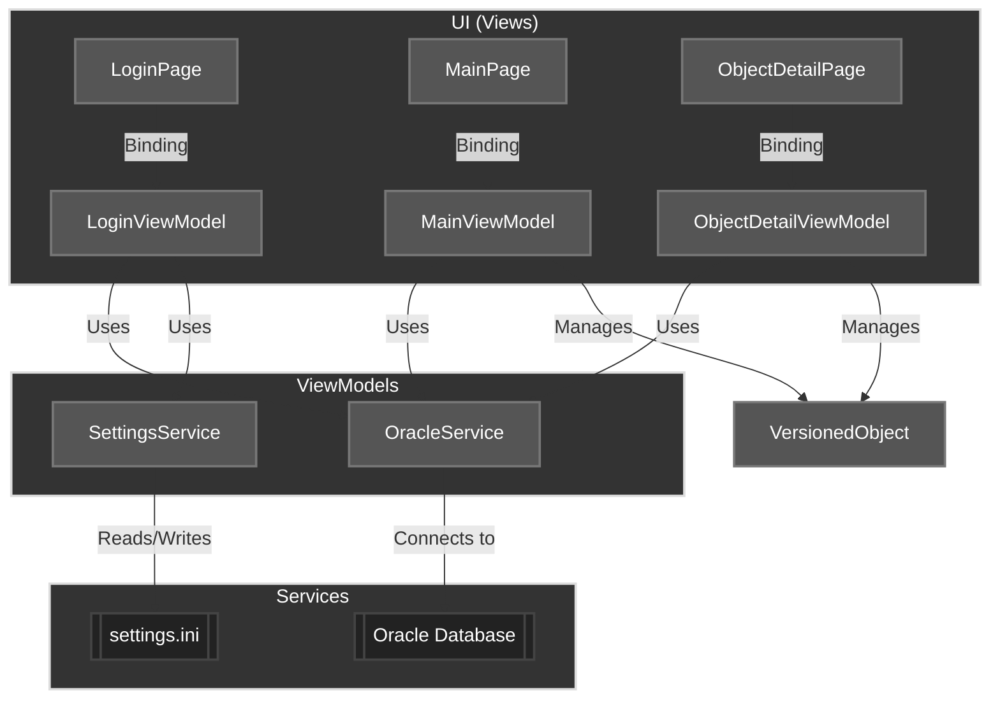

# Database Team Coding

Oracle Version Control is a version control system for Oracle database objects, developed in .NET MAUI (.NET 9) with a modern interface and Oracle database integration. The system manages check-in/check-out of objects, status viewing, DDL downloads, and change history.

## Features
- Secure login with configuration storage
- Listing, searching, and pagination of versioned objects
- Check-out and check-in of Oracle objects
- Download DDL of selected objects
- Object detail viewing
- Multi-field sorting and filtering
- Responsive modern interface

## Project Structure
- **Views**: Screens (LoginPage, MainPage, ObjectDetailPage)
- **ViewModels**: Presentation logic (LoginViewModel, MainViewModel, ObjectDetailViewModel)
- **Models**: Data representation (VersionedObject)
- **Services**: Data access and configuration services (OracleService, SettingsService)
- **Resources**: Icons, splash screen, etc.

## Workflow
1. **Login**: User enters credentials and Oracle settings
2. **MainPage**: Displays list of versioned objects with search, sorting, and pagination
3. **Check-out/Check-in**: Users can reserve (check-out) or release (check-in) objects (comments required)
4. **Details**: View object details and download DDL
5. **Logout**: Ends session and returns to login

## Architecture Overview

## Key Classes and Responsibilities
LoginViewModel: Manages authentication, loads/saves settings

MainViewModel: Handles listing, search, pagination, check-in/out, and object downloads

ObjectDetailViewModel: Displays selected object details

OracleService: Oracle connection, queries, and procedures (check-in/out, search, DDL)

SettingsService: Local configuration persistence

VersionedObject: Data model for versioned objects

## Requirements
.NET 9

.NET MAUI

Oracle.ManagedDataAccess

UraniumUI (UI)

## Notes
The system never modifies Oracle objects without prior check-out

Comments are mandatory for check-in/out operations

Configurations are saved locally (settings.ini)
